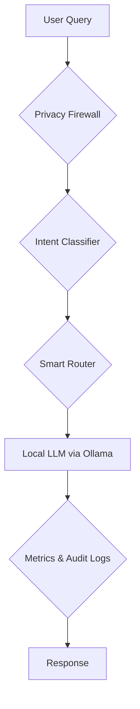

# 🔀 Cortex-Bench: AI Routing System with Privacy Firewall

*Intelligent, offline-first AI system that dynamically selects the best local LLM while protecting sensitive user data through a real-time privacy firewall.*

---

## 🎥 Demo

*A brief video demonstrating the application's features and functionality.*

[](demo/demo_video.mp4)

> **Note**: Replace `VIDEO_ID` with the actual ID of your YouTube video.

---

## 🚀 Overview

This project is a **privacy-first, fully local AI routing system** designed to run multiple Small Language Models (SLMs) using **Ollama**. It dynamically selects the best model based on the user's query intent, detects and masks sensitive data before inference, and benchmarks model performance in terms of speed versus quality.

### 💡 Key Motivations

- **🔒 Privacy**: Avoids external API calls, ensuring all data remains within the local environment.
- **⚡ Latency**: Achieves low-latency responses through local inference.
- **💰 Cost-Effective**: Eliminates API usage costs, making it a budget-friendly solution.

---

## 🧠 Key Features

### 🔀 Intelligent Model Routing

- **Intent Classification**: Automatically classifies query intent (e.g., coding, reasoning, creative writing).
- **Optimal Model Selection**: Routes queries to the most suitable model:
  - **⚡ `phi3:mini`**: Ideal for fast, coding-related tasks.
  - **⚖️ `llama3.2:3b`**: Provides balanced and general-purpose responses.
  - **🧠 `mistral:7b`**: Best for deep reasoning and complex queries.

### 🛡️ Privacy Firewall

- **Core Innovation**: Built using **Microsoft Presidio** and **spaCy** for robust data protection.
- **PII Detection**: Detects and masks a wide range of personally identifiable information, including:
  - Emails, phone numbers, and credit card numbers.
  - Custom patterns for Indian context, such as Aadhaar, PAN, and UPI IDs.
- **Reversible Anonymization**: Masks data in a reversible format, allowing for de-anonymization if needed.
  ```
  John Doe → <PERSON_1>
  john.doe@example.com → <EMAIL_1>
  ```

### 📊 Benchmarking Engine

- **Performance Comparison**: Compares models based on:
  - **⏱ Latency**: Time taken to generate a response.
  - **🔤 Tokens/sec**: Speed of token generation.
  - **🧠 Response Quality**: Effectiveness of the generated response.
- **CLI Runner**: Generates structured results for easy analysis.

### 🌐 Full-Stack Application

- **⚙️ Backend**: Built with **FastAPI** for high performance.
- **🎨 Frontend**: Interactive UI created with **Streamlit**.
- **🗄️ Database**: **SQLite** for storing audit logs and benchmarking results.
- **🔁 Real-Time Streaming**: Uses Server-Sent Events (SSE) for real-time token output.

---

## 🏗️ System Architecture

The following diagram illustrates the flow of a user query through the system:



---

## ⚙️ Tech Stack

| Layer       | Technology                               |
|-------------|------------------------------------------|
| LLM Runtime | **Ollama**                               |
| Backend     | **FastAPI**                              |
| Frontend    | **Streamlit**                            |
| NLP         | **spaCy**                                |
| Privacy     | **Microsoft Presidio**                   |
| Database    | **SQLite**                               |
| Benchmark   | **Python** with **Rich**                 |

---

## 📦 Installation and Setup

### 1. Install Ollama

First, install Ollama on your system:
```bash
curl -fsSL https://ollama.com/install.sh | sh
ollama serve
```

### 2. Pull Required Models

Next, pull the necessary language models:
```bash
ollama pull phi3:mini
ollama pull llama3.2:3b
ollama pull mistral:7b
```

### 3. Set Up Python Environment

Create and activate a virtual environment:
```bash
python -m venv .venv
source .venv/bin/activate  # On Windows, use: .venv\Scripts\activate
pip install -r requirements.txt
```

### 4. Install spaCy Model

Download the required spaCy model for NLP tasks:
```bash
python -m spacy download en_core_web_lg
```

### 5. Run Health Check

Verify that the setup is correct by running the health check script:
```bash
python health_check.py
```

---

## ▶️ Running the Application

### Start the Backend Server

To start the FastAPI backend, run:
```bash
uvicorn backend.server:app --reload
```

### Start the Frontend Application

To launch the Streamlit frontend, run:
```bash
streamlit run frontend/app.py
```

---

## 📊 Benchmarking

To run the benchmarking tests, execute the following command:
```bash
python -m benchmarks.runner
```
This will output a detailed comparison of model latency, token generation speed, and overall efficiency.

### Example Tradeoffs

| Model       | Speed ⚡ | Quality 🧠 | Memory 💾 |
|-------------|-----------|------------|-----------|
| `phi3:mini` | High      | Medium     | Low       |
| `llama3.2:3b`| Medium    | Medium+    | Medium    |
| `mistral:7b`| Low       | High       | High      |

---

## 🔒 Privacy-First Design

- **❌ No External APIs**: All processing is done locally, ensuring no data leaves your machine.
- **✅ PII Masking**: Sensitive information is masked before being processed by the models.
- **✅ Secure Routing**: Queries containing sensitive data can be routed to smaller, more secure models.

### Example Flow

**Input:**
```
My Aadhaar number is 1234 5678 9123. Can you explain recursion?
```

**Processed:**
```
My Aadhaar number is <IN_AADHAAR_1>. Can you explain recursion?
```

---

## 📊 Dashboard Features

- **Routing Decision Logs**: View logs of how different queries were routed.
- **Privacy Audit History**: Track and review all detected and masked PII.
- **Model Performance Charts**: Visualize and compare the performance of different models.

---

## 🐳 Docker Support

For a containerized setup, you can use Docker Compose:
```bash
docker compose up --build
```
This will build and run all the necessary services, including Ollama, the backend, and the frontend.

---

## 📌 Future Improvements

- **GPU Acceleration**: Add support for GPU to speed up inference.
- **Fine-Tuned Routing Model**: Train a more sophisticated model for routing decisions.
- **Multi-Language PII Detection**: Extend PII detection to support multiple languages.
- **RAG Integration**: Integrate a Retrieval-Augmented Generation (RAG) pipeline with a local vector database.

---

## 🤝 Contributing

Contributions are welcome! Please follow these steps:
1. Fork the repository.
2. Create a new feature branch.
3. Submit a pull request with your changes.

---

## 📜 License

This project is licensed under the **MIT License**. See the [LICENSE](LICENSE) file for more details.

---

## 💡 Why This Project Matters

This project serves as a practical example of:
- Real-world AI system design and architecture.
- Implementing privacy-aware AI solutions.
- Benchmarking and performance optimization in AI systems.
- Intelligent orchestration of multiple language models.

---

## 👨‍💻 Author

**Nilanjan Saha**

- Passionate about AI, MLOps, and system design.
- Focused on building practical and real-world AI infrastructure projects.

---

## ⭐ Acknowledgments

If you find this project useful, please give it a star ⭐ and share it with others!

